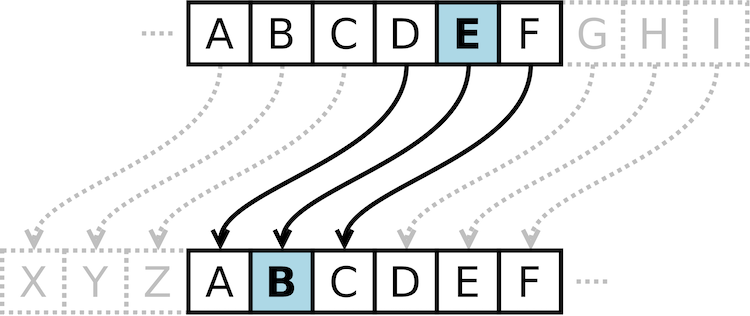
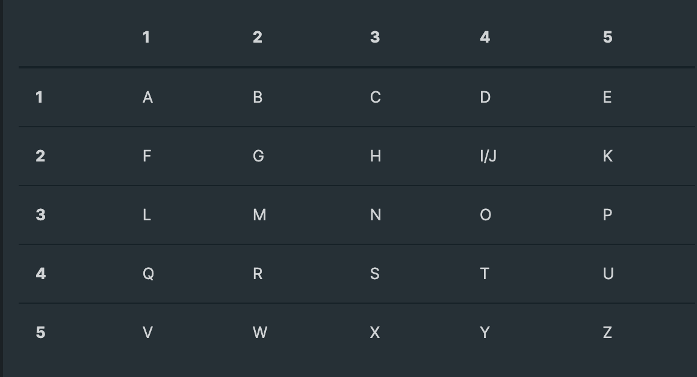

# Decoder Ring

### JS Code written by Devina Gillis
### Tests written by Devina Gillis and Thinkful 

The Decoder Ring project is one of my Capstone projects as a student at _Thinkful_. This project includes three fun decoding puzzles: 

1. **Caesar Shift:**
  This function takes an inputted message and decodes or encodes it by using the correct shift value. 
  For example: 

  ```caesar(input, shift, encode = false){}```

  Input is the parameter that takes a message as an argument. Shift is the parameter that should be given a number to shift the letters in the alphabet by. If encode is set to true, it will encode the message, if set to false, it will decode the inputted message. 

  

2. **Polybius Square:**
   This function assigns a given letter a number based on its position in the Polybius Square. 

   

   ```polybius(input, encode = false){}```

   Like the Caesar shift, it takes an inputted message, and will either encode or decode the message using the Polybius Square key.

3. **Substitution Cipher:**
   This function encodes or decodes a message using a substituted alphabet, where the location of the letter of the substituted alphabet should be translated to the corresponding letter in the English alphabet.

   

   ```substitution(input, alphabet, encode = true){}```

   The inputted message will be encoded or decoded using the substituted alphabet argument given to the alphabet parameter.


